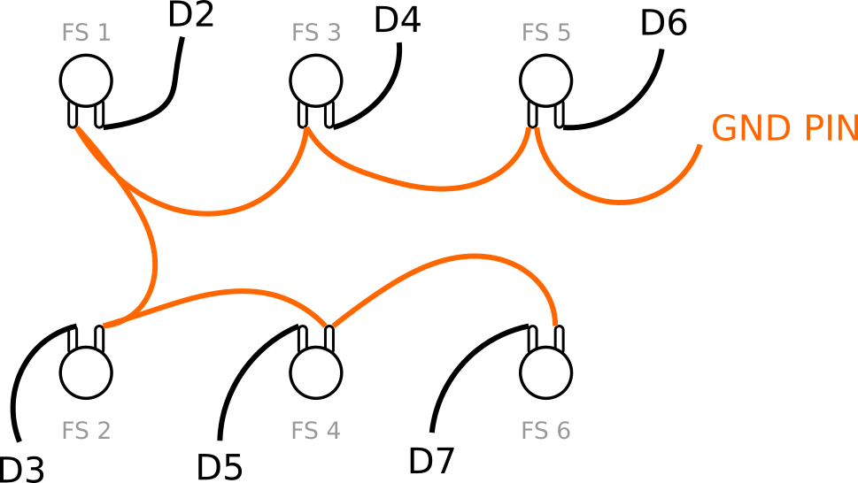
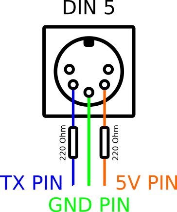

## Load firmware

This repo contains PlatformIO project with firmware for your controller. Please follow [official guide](https://docs.platformio.org/en/latest/core/quickstart.html) and upload code into your arduino nano board.

## Wiring

## DIN 5 socket

## LCD

Connect lcd with provided instruction. I2C should have 4 pins. Connect GND to GND pin, VCC to 5V pin.

If you are using the arduino nano board, SDA should be connected to A4 pin, SCL to A5 pin.

## Power supply

Power whole board using usb or connect selected power source (for me the best choice is 9V battery) to GND and VCC pins of arduino board.

## Is it everything?

Yup. Easy, right?
