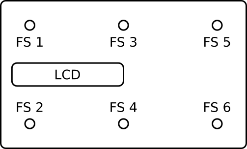

# Manual

This document contains how to use and configure the controller.

## Footswitch map

## Enter configuration mode

Press both FS2 and FS4 footswitches. LCD should display information that you are in the configuration mode.

## Configuration

First of all, you have to select the footswitch that you want to configure. Press the footswitch you want to configure. If you want to configure the long press, you should press it for more than 1 second. If you want to configure the double click, you should press it twice in short period of time.

Next, you have to set MIDI channel.

**Use FS1 and FS2 to change value**

**Use FS4 to submit selected value**

After that, you have to configure command type that will be assigned to the footswitch.

Available commands:
* Note - send MIDI note 
* CC - send MIDI CC
* Toggle CC - Toggle two values of one CC
* Next page - go to next configuration page
* Prev page - go to the previous configuration page
* Go to page - go to the selected page

Pass the rest of the configuration using FS1, FS2 and FS4.

## Exit configuration mode

Press both FS2 and FS4 footswitches. LCD should display information that you are not in the configuration mode.

## Display current configuration

Press both FS1 and FS3 footswitches.

## USB MIDI mode
To enter USB MIDI mode, push both FS4 and FS6. The device should restart in USB MIDI mode. To go back to MIDI mode, push both FS4 and FS6.