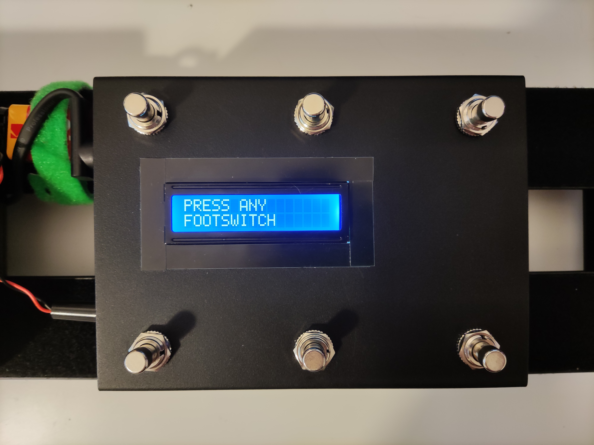
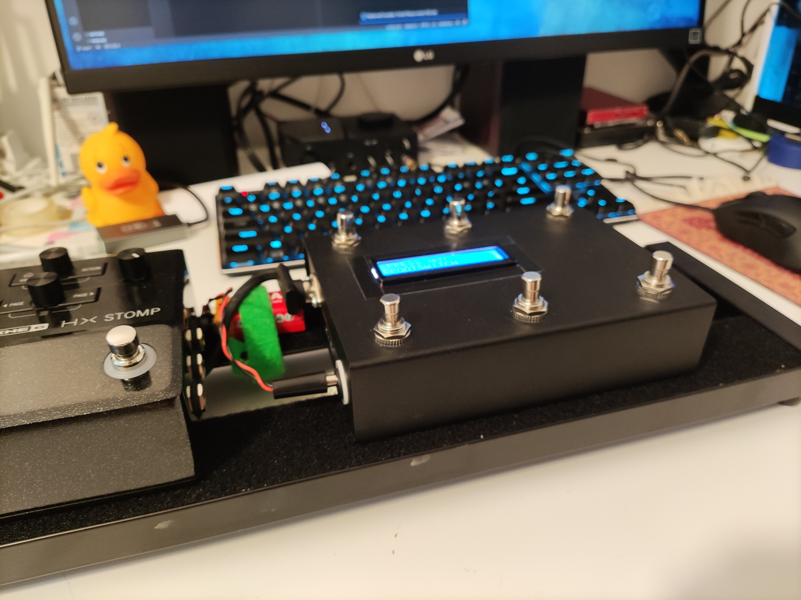

# Open Midi Controller
Open source firmware for 6 button midi controller based on arduino. It's fully configurable and don't need computer connection. Build you own midi controller and save a lot of money. 

# Features

Most important features:

* 6 buttons, each can be assigned to two actions. First action is triggered on footswitch click, second one is triggered when switch is pressed for more than 1 second.
* LCD status screen
* Configurable without computer connection
* Supported midi commands: Note, CC - send one value, CC - toggle two values
* Five "pages" of configuration. You can assign action to footswitch and toggle between five different configurations
* Working with USB MIDI using serial port. You'll need to use additional software like [Hairless Midi](https://projectgus.github.io/hairless-midiserial/), [ttymidi](https://github.com/cjbarnes18/ttymidi) or [SerialMidiBridge](https://github.com/RuudMulder/SerialMidiBridge) to control your DAW or plugins. Just set port and baudrate of 115200 and it should work.

It's easy to calculate that with 6 footswitches, 2 actions for each footswitch and 5 possible configuration pages allows you to assing 60 different commands! Thats a lot.

Features comming soon:
* Double click support
* Momentary page change

# Build cost
Cost of parts if you decide to order them in popular Chinese store.

| Part | Cost |
| ---- | ---- |
| Arduino Nano | 2 - 3 USD |
| Arduino Nano Shield (if you don't want to solder) | 1 USD |
| LCD with I2C module | 2 - 2.5 USD |
| Momentary Footswitches | 6 x 1 - 1.5 USD |
| DIN 5 and other stuff | 1 USD |
| TOTAL | 12 - 16.5 USD  |

*You have to add the cost of the case and soldering supplies. I'm using a case described as T25. It costs about 8 USD. You can make the case of almost anything.*

# Branches

The idea is to keep in the main branch only the code that don't need any hardware changes. So once you build your own device, you won't need to change it. Adding mods to hardware is possible using other branches. 

So features like:
* 10 switches
* additional jack outputs for expression pedals
* led status diodes

are possible and can be implemented, but they will never be part of the main branch. 

I want to keep the device easy and cheap to build but still highly moddable.

# Build instruction

FAQ:

* **Do I need to know how to solder?** - A little bit. If you can solder two wires together, you have the necessary skills. 
* **Do I need to know C++?** - No
* **Is it hard to create my own controller?** - Relatively easy

See [BUILD](./BUILD.md).

*Remember to follow the build instructions. I cannot get the responsibility if you mess something up. Everything you do, you do on your own responsibility. I just provided a free firmware for your device.*

# Manual

See [MANUAL](./MANUAL.md).

# Feature requests

Leave me an issue on github. It's highly possible that I will implement it.

# Changelog

See [CHANGELOG](./CHANGELOG.md).

# Build photos

Send me your build photos. I will post it here :)

My build:

