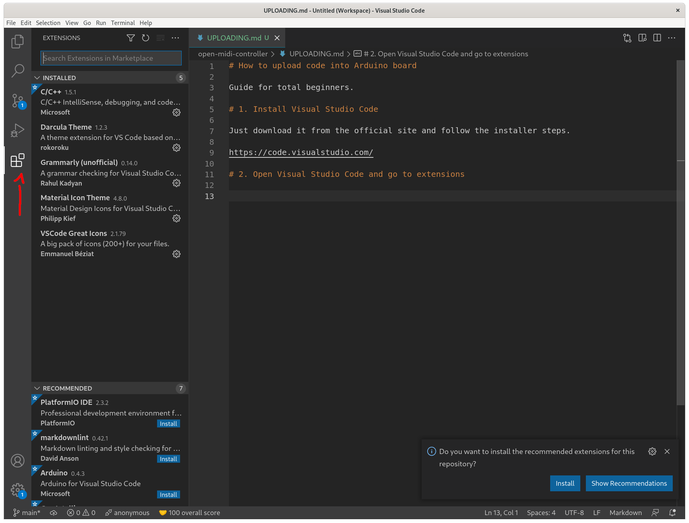
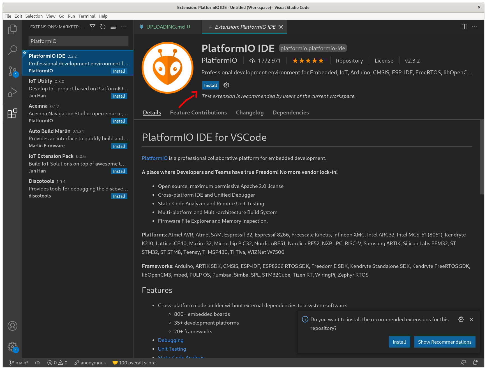
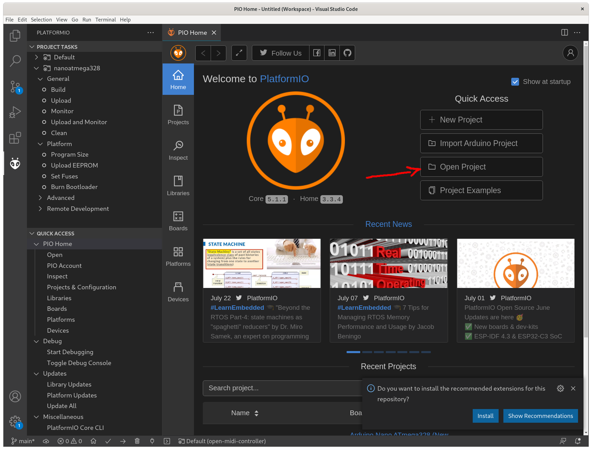
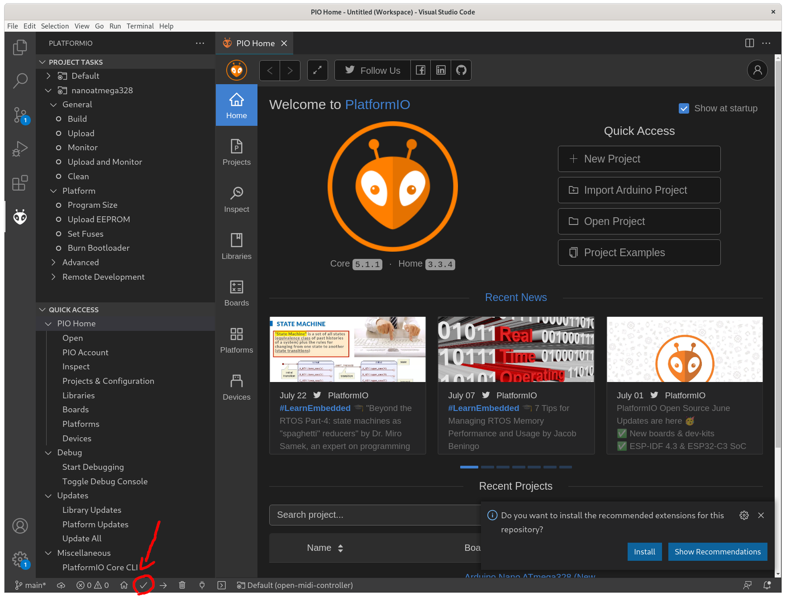
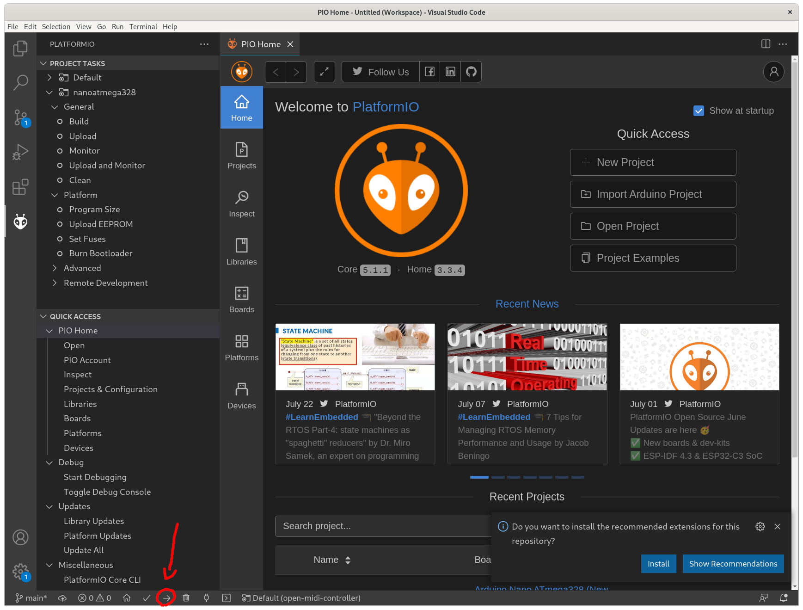

# How to upload code into Arduino board

Guide for total beginners.

# 1. Install Visual Studio Code

Just download it from the official site and follow the installer steps.

https://code.visualstudio.com/

# 2. Open Visual Studio Code and go to extensions

# 3. Install PlatformIO IDE extension

# 4. PIO Home should appear, open project

# 5. Compile code

# 6. Upload code

## Troubleshooting

If something is not working try to follow official PlatformIO instructions or just google error messages. I had no problems with installation and code uploading, it just worked out of the box.

